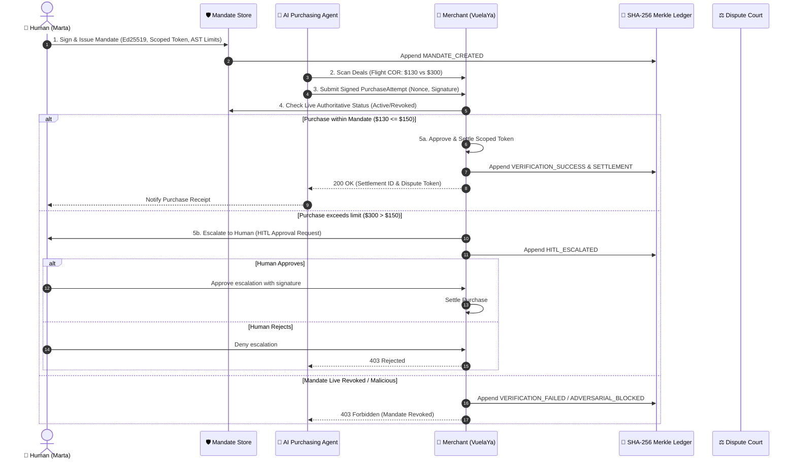

# 🛡️ AgentBuyer // Safe Agentic Purchasing Protocol

[](https://www.python.org/)
[](https://fastapi.tiangolo.com)
[](https://react.dev)
[](https://cryptography.io)
[](#the-trial-by-fire)
[](#adversarial-security-suite)

> **Hackathon Reto 01:** *El comprador que no es humano*  
> **Repository:** [https://github.com/anapaolaoviedo/AgentBuyer](https://github.com/anapaolaoviedo/AgentBuyer)

---

## 📌 Executive Summary

Every modern payment system assumes the entity pressing **"Pay"** is a human. As autonomous AI agents take over shopping, flight booking, and B2B restocking, this assumption is breaking down:
- **Merchants** either block bots (losing legitimate revenue) or let them pass (absorbing massive fraud and chargebacks).
- **Cardholders** refuse to give raw credit cards (PAN/CVV) to autonomous models.
- **Banks & Auditors** have no mathematical mechanism to determine liability when an agent hallucinates or goes rogue.

**AgentBuyer** solves this crisis with a complete cryptographic purchasing circuit:
1. ✍️ **Cryptographic Mandates:** Humans delegate non-negotiable purchasing authority using **Ed25519 asymmetric signatures**.
2. 💳 **Zero Raw Card Exposure:** Payments utilize **scoped virtual tokens** bound cryptographically to the mandate hash.
3. 🏪 **Independent Fail-Closed Merchant Verification:** 6-stage verification checking signatures, AST conditions, rolling budgets, and live revocation status.
4. 🚨 **The Trial by Fire (Live Revocation):** Synchronous authoritative registry guarantees that revoked mandates fail instantly in < 1ms without caching delays.
5. ⚖️ **Automated Dispute Arbiter:** Deterministic liability resolution using an append-only **SHA-256 Merkle hash chain**.

---

## 🏛️ System Architecture & 4-Party Circuit



---

## 🚀 Quickstart & Setup

### 1. Environment Setup
```bash
# Clone the repository
git clone https://github.com/anapaolaoviedo/AgentBuyer.git
cd AgentBuyer

# Create and activate virtual environment
python -m venv .venv
# On Windows:
.venv\Scripts\activate
# On Linux/macOS:
source .venv/bin/activate

# Install dependencies
pip install -r requirements.txt

# Real web search (flight/hotel discovery) requires an OpenAI key:
echo "OPENAI_API_KEY=sk-..." > .env
```

### 2. Launch the API Server (Backend)
```bash
uvicorn api.main:app --port 8000
```
API Documentation (Swagger UI): `http://localhost:8000/docs`

### 3. Launch the Mission Control UI (Frontend)
```bash
cd frontend
npm install
npm run dev
```
Open your browser at `http://localhost:5173`.

> **Note:** the agent discovers **real, live offers** via web search — there is no
> mock catalog. Without network access / `OPENAI_API_KEY`, the agent honestly
> reports "no offers found" instead of inventing data.

---

## 🧪 Automated Testing & Defense Suite

### Run the Pytest Integration Suite
```bash
pytest tests/ -v
```

### Run the 8-Vector Adversarial Attack Simulator
```bash
python mandate/adversarial_tests.py
```

```
======================================================================
🔒 RUNNING AGENTBUYER ADVERSARIAL ATTACK TEST SUITE (8 VECTORS)
======================================================================

[ATTACK 1] Simulating Replay Attack (Re-submitting used nonce)...
  ✅ BLOCKED: Replay attack intercepted via nonce verification.

[ATTACK 2] Simulating In-Flight Payload Tampering (Signature Mismatch)...
  ✅ BLOCKED: Tampered amount detected via agent cryptographic signature check.

[ATTACK 3] Simulating Category Constraint Violation (Buying Rolex under Flight mandate)...
  ✅ BLOCKED: Category mismatch caught by fail-closed evaluator.

[ATTACK 4] Simulating Live Revocation (The Trial by Fire)...
  ✅ BLOCKED: Live revocation immediately terminated purchasing ability.

[ATTACK 5] Simulating Agent Impersonation Attack...
  ✅ BLOCKED: Unregistered agent identity rejected.

[ATTACK 6] Simulating Forged Mandate Signature Attack...
  ✅ BLOCKED: Forged human mandate signature detected and rejected.

[ATTACK 7] Simulating Frequency & Budget Limit Exhaustion...
  ✅ BLOCKED: Budget and execution counter limits strictly enforced.

[ATTACK 8] Simulating AST Sandbox Escape & Prompt Injection Attack...
  ✅ BLOCKED: Malicious AST code construct safely rejected (fail-closed sandbox).

======================================================================
🏆 ALL 8 ADVERSARIAL ATTACKS SUCCESSFULLY BLOCKED WITH ZERO BREACHES!
======================================================================
```

---

## 🔥 The "Trial by Fire" Live Demonstration Walkthrough

During the hackathon defense, judges will operate the system live. Here is the exact script:

### Case Study: VuelaYa & Marta
- **Merchant:** VuelaYa (Online Travel Agency).
- **Buyer:** Marta authorizes her personal agent: *"Buy me a flight to Córdoba if it drops below \$150, valid until the end of the month"*.

1. **Step 1 — Issue the Mandate (Enrollment):**
   - The wizard walks Marta through identity + biometrics, card tokenization
     (the agent never sees the raw card), and her verifiable limits.
   - Click **"AUTHORIZE SATURDAY"** — the signed mandate is issued and logged.
2. **Step 2 — Autonomous Discovery & Human-in-the-Loop:**
   - Click **"RUN AGENT"** — Saturday searches **real, live fares** on the web
     (takes 30–60s) and picks the cheapest offer that satisfies the price
     condition.
   - If the best real offer satisfies **every** rule, it buys autonomously.
   - If any rule is not met 100% — e.g. the offer comes from a merchant outside
     the mandate, or exceeds the price cap — the verdict is `ESCALATE`: the
     purchase stops and **Marta decides** with 1-click **Approve** / **Decline**.
     Nothing is ever approved silently.
3. **Step 3 — The Trial by Fire (Live Revocation):**
   - Click **"REVOKE MANDATE"** (judges are welcome to click it themselves).
   - Click **"RUN AGENT"** again.
   - 💥 **Outcome:** instant fail-closed rejection — mandate revoked. Zero
     delays, zero caching leaks, no team intervention.
4. **Step 4 — Chargeback Dispute Arbitration:**
   - Open **"My purchases"** → click **"⚖ I don't recognize this charge"** on
     any completed purchase.
   - The arbiter replays the hash-chained audit trail and deterministically
     rules whether Human, Agent, or Merchant is liable — with the evidence shown.
5. **Step 5 — The Full Story:**
   - Open **"Audit"** — every decision above is in the append-only, SHA-256
     hash-chained trail, readable by human, merchant, and auditor.

---

## 📚 Deliverables & Documentation Index

- 📐 **Architecture Specification:** [docs/ARCHITECTURE.md](docs/ARCHITECTURE.md)
- 📝 **Architecture Decision Log (ADRs):** [docs/DECISION_LOG.md](docs/DECISION_LOG.md)
- 🎤 **Presentation Script & Defense:** [docs/PRESENTATION.md](docs/PRESENTATION.md)
- 🖥️ **Interactive Pitch Slide Deck:** [docs/slides.html](docs/slides.html)

---

## ⚖️ License
MIT License. Developed for NextWave Hackathon 2026.
