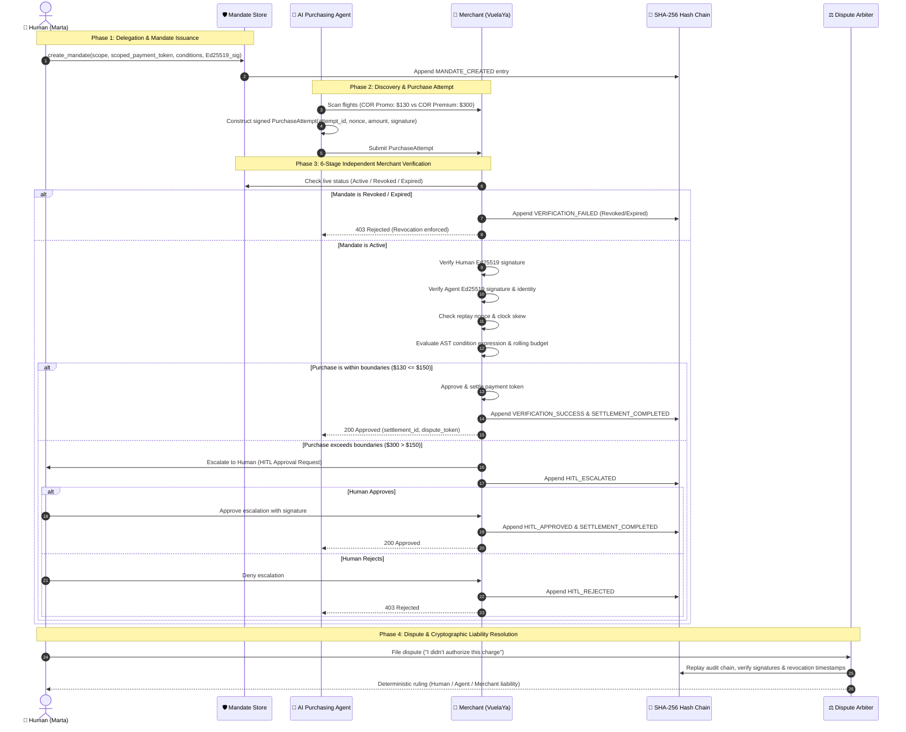

# AgentBuyer Architecture Specification

## 1. System Overview

**AgentBuyer** is an end-to-end cryptographic protocol and execution engine designed to enable autonomous AI purchasing agents to buy on behalf of humans without exposing raw credit cards, preventing unauthorized spending, ensuring fail-closed merchant verification, enabling real-time live revocation (the Trial by Fire), and resolving disputes through an immutable Merkle audit ledger.

```mermaid
graph TD
    subgraph Human Boundary
        Human[👤 Human / Cardholder (Marta)]
        HK[🔑 Human Keypair (Ed25519)]
        Human -->|Signs Mandate| M[📜 Purchase Mandate]
        Human -->|Generates| PT[💳 Scoped Virtual Token]
        M --- PT
    end

    subgraph Autonomous Agent Boundary
        Agent[🤖 Purchasing Agent]
        AK[🔑 Agent Keypair (Ed25519)]
        CatalogScan[📡 Market / Catalog Scanner]
        Agent --> CatalogScan
        CatalogScan -->|Evaluates Deal vs Mandate| Agent
        Agent -->|Signs Attempt| PA[📝 Purchase Attempt + Nonce]
    end

    subgraph Merchant Boundary
        Merchant[🏪 Merchant (VuelaYa Travel)]
        Engine[🛡️ 6-Stage Verification Engine]
        Settlement[💰 Settlement Subsystem]
        Merchant --> Engine
        Engine -->|If Approved| Settlement
    end

    subgraph Authoritative Core
        Registry[🏛️ Authoritative Mandate Store]
        Ledger[📜 SHA-256 Merkle Audit Ledger]
        Court[⚖️ Dispute & Chargeback Arbiter]
    end

    Human -->|Registers Mandate & Live Revokes| Registry
    Registry -->|Authoritative Status (No Cache)| Engine
    PA -->|Submitted to| Merchant
    Engine -->|Logs Every Event| Ledger
    Human -.->|Files Dispute| Court
    Court -->|Replays Cryptographic Proofs| Ledger
```

---

## 2. The 4-Party Protocol Flow



---

## 3. Cryptographic Primitives & Threat Model

### Cryptographic Foundation
1. **Ed25519 High-Speed Asymmetric Signatures:**
   - Both the Human and the Agent have distinct cryptographic keypairs.
   - Mandate is signed by `human_privkey`, verifiable via `human_pubkey`.
   - Purchase attempt is signed by `agent_privkey`, verifiable via `agent_pubkey` bound inside the mandate.
2. **Canonical JSON Serialization:**
   - Deterministic sorting of keys (`sort_keys=True, separators=(',', ':')`) guarantees that JSON representations are byte-identical across platforms, preventing signature malleability attacks.
3. **Scoped Virtual Payment Tokens:**
   - Raw PAN (Primary Account Number) and CVV are NEVER transmitted or stored in the agent's memory or merchant records.
   - A cryptographically scoped token (`vtok_...`) bound to the mandate hash is used for settlement.

### Threat Model & Mitigations
| Threat Vector | Attack Description | Mitigation in AgentBuyer |
| :--- | :--- | :--- |
| **Replay Attack** | Malicious agent or eavesdropper captures an approved purchase attempt and resubmits it. | Unique cryptographic nonces per attempt; state manager rejects previously used nonces. |
| **Payload Tampering** | Attacker intercepts attempt and alters price from \$130 to \$300 in transit. | Agent's digital signature over canonical payload fails merchant verification. |
| **Rogue Agent Impersonation** | Rogue bot attempts to charge against a victim's active mandate. | Merchant verifies that `attempt.agent_id` and signature match the `agent_pubkey` strictly registered in the human's mandate. |
| **Revocation Evasion (Trial by Fire)** | Agent attempts to purchase after cardholder withdrew permission. | Merchant performs zero-cache, synchronous live queries to the authoritative Mandate Registry. |
| **Prompt Injection / AST Escape** | Malicious condition strings containing code execution (`__import__('os')...`). | Sandboxed AST NodeVisitor rejecting dangerous nodes (Calls, Attributes, Imports) with fail-closed security. |
| **Budget & Frequency Depletion** | Agent executes rapid micro-transactions to drain cardholder funds. | Rolling monthly budget and execution count limits enforced in state registry. |
| **False Chargeback Claims** | Cardholder falsely denies an authorized purchase. | Merkle hash chain proves valid human signature, agent signature, and boundary compliance, resolving human liability mathematically. |
